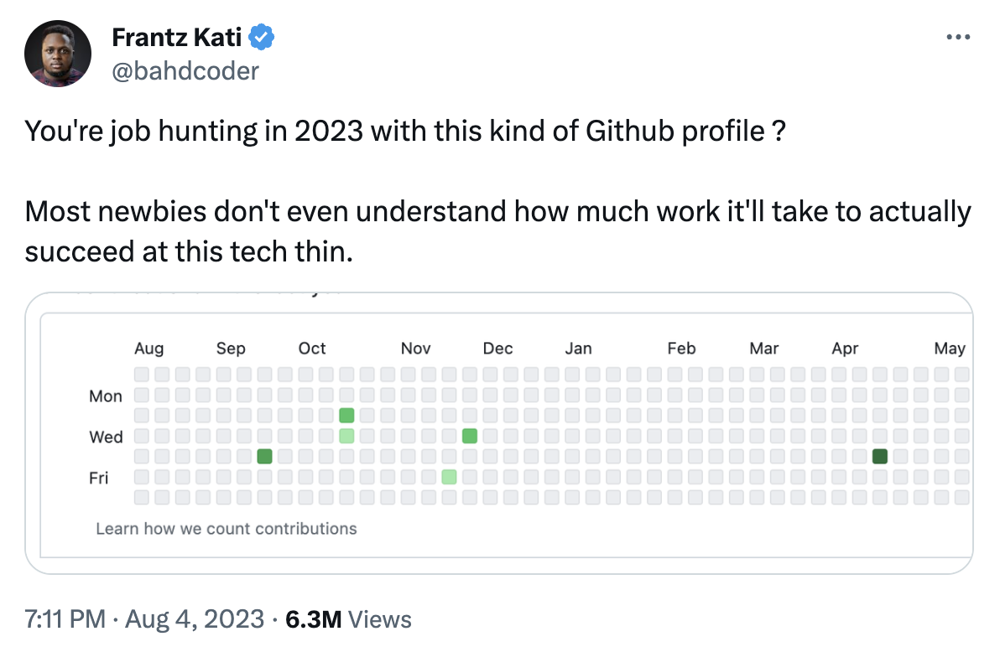

# The open source rollercoaster

The story of taking over a large Github project

  
    Press Space for next page <carbon:arrow-right class="inline"/>
  

  <a href="https://github.com/jensborch/rmwc-takeover" target="_blank" alt="GitHub"
    class="text-xl slidev-icon-btn opacity-50 !border-none !hover:text-white">
    <carbon-logo-github />
  </a>

---
transition: fade-out
hideInToc: true
layout: center
---

# Table of contents

<Toc minDepth="1" maxDepth="5"></Toc>

---
layout: center
hideInToc: true
---

# Opens Source software consititute 70-90% of any given piece of modern software solution

<a href="https://www.linuxfoundation.org/blog/blog/a-summary-of-census-ii-open-source-software-application-libraries-the-world-depends-on">The Linux Foundation Open Source Software (FOSS)</a>

---
layout: center
hideInToc: true
---
# Faker.js

---
layout: center
hideInToc: true
---

<a href="https://www.theverge.com/2022/1/9/22874949/developer-corrupts-open-source-libraries-projects-affected">“Respectfully, I am no longer going to support Fortune 500s (and other smaller sized companies) with my free work”</a>

---

---
layout: center
transition: fade-out
---

# We have a responsibility to give something back

---
layout: center
---

  <a href="https://github.com/rmwc/rmwc" target="_blank" alt="GitHub"
    class="text-xl slidev-icon-btn opacity-50 !border-none !hover:text-white">
    <carbon-logo-github />
  </a>

---
layout: center
hideInToc: true
---

# What

A React UI Kit built on Google's official Material Components Web library

---
layout: iframe
url: https://rmwc.io
---

---
layout: center
hideInToc: true
---

# Why

* Based on <a href="https://github.com/material-components/material-components-web">Google Material Components for the Web</a>
* Avoids breaking changes (at all cost)
* Individually packaged and released components
* Not opinionated on e.g. styling
* Accessible
* How we would have done it on our own 😉

---
layout: center
---

# Alternatives

---
layout: center
hideInToc: true
---

# Material UI or MUI

* Not based on Google Material Components for the Web
* Many breaking changes 💔
* Opinionated on styling etc.
* Today MUI has better traction than RMWC

---
layout: center
---
# The takeover timeline

---
layout: center
---
# History

* Version 1 was released in January 2018
* Created by James Friedman
* Primarily a solo endeavor, truly remarkable
* Adopted by us in May 2018
* Today we have around 10 applications based on RMWC

---
layout: center
---
# Abandonment

* Despite internal usage at Google, progress slowed down towards the end of 2020
* Not updated to latest version of Google Material Components for the Web
* Bugs weren't fixed
* Building our applications started to become problematic
* The community wasn't making significant contributions

---
layout: center
---

---
layout: center
---

---
hideInToc: true
layout: center
---

# Options

---
hideInToc: true
layout: center
---

# Migrate to MUI
* Large effort
* Big bang migration or double maintenance
* Bad history of breaking changes
* Not a particular fun job to do

---
hideInToc: true
layout: center
---

# Start contributing to RMWC
* Fun and exiting
* Might even be cheaper
* Our chance to contribute

---
layout: center
---
# The friendly takeover part 1

* We got in contact with James around the beginning of 2022
* His ability to contribute to the project had diminished
* <a href="https://github.com/rmwc/rmwc/issues/758https://github.com/rmwc/rmwc/issues/758">Project Lazarus</a> was started to bring RMWC up to date

---
hideInToc: true
layout: center
---

# The team

---
hideInToc: true
layout: center
---

# What did we do?

* Weekly meetings
* Establish trust
* Defined a roadmap (Googler Material version 5 ➡ 8)
* Started working

---
layout: center
---
# The friendly takeover part 2

* After a while, it became evident that James couldn't allocate the required time to invest in the project
* RMWC was changed from a repo on James's profile into an Github organization
* We ended up with the keys to the kingdom 😨🔑
* We are now working on releasing RMWC version 14 based on Google Material version 14

---
layout: center
---

# Challenges

---
layout: center
hideInToc: true
---

# Getting the needed time
* Management was positive
* Initial work done as part of maintenance
* Front-end organization scaling

---
layout: center
hideInToc: true
---
# Yak shaving ✂💈
Yak shaving is programming lingo for the seemingly endless series of small tasks that have to be completed before the next step in a project can move forward.

---
layout: center
hideInToc: true
---
# Other challenges
* Corporate Windows setup (🍏❤)
* Learning curve 📈

---
layout: center
---
# Benefits

* Fun and energizing ⚡
* Career enhancing
* Branding possibilities
* Control and independence
* Active GitHub profile

---

---

---
layout: center
---

---
layout: center
---

---
hideInToc: true
layout: center
---

# Slides created with Slidev

[Documentations](https://sli.dev) · [GitHub](https://github.com/slidevjs/slidev) · [Showcases](https://sli.dev/showcases.html)
